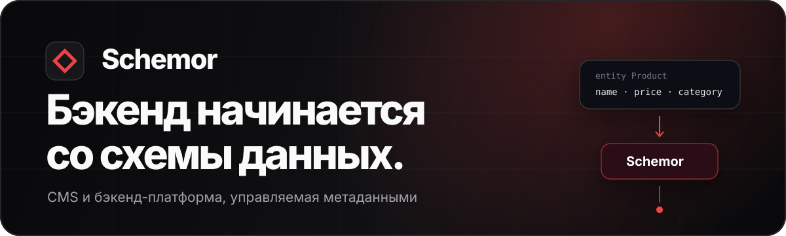
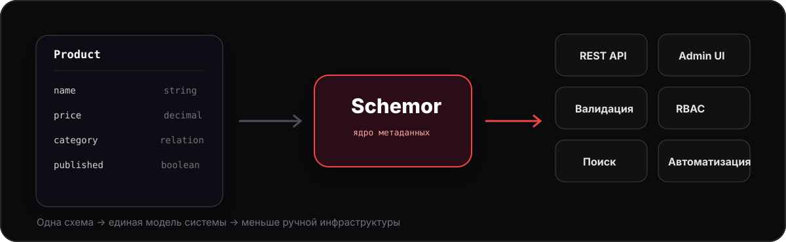
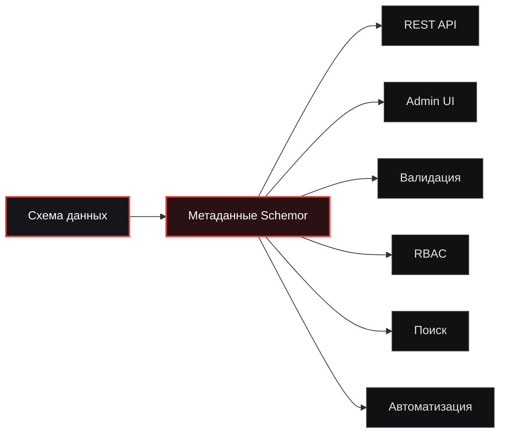
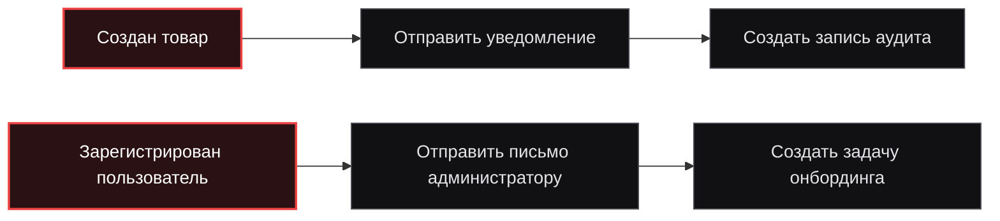
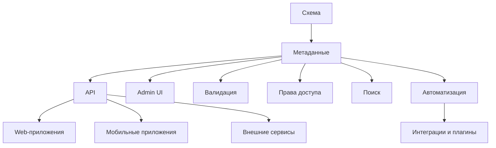
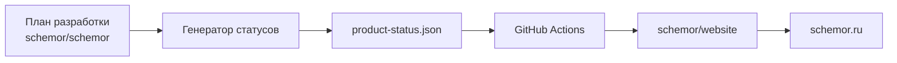
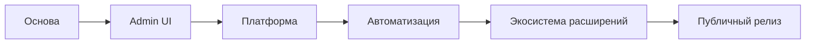

<p align="center">
  
</p>

<p align="center">
  <a href="https://schemor.ru"></a>
  <a href="https://github.com/schemor/schemor"></a>
  <a href="https://github.com/schemor/website"></a>
</p>

<p align="center">
  
  
  
  
  
</p>

---

## Что такое Schemor

**Schemor** — CMS и бэкенд-платформа, в которой схема данных становится основой всей системы.

Вместо того чтобы отдельно собирать модели, CRUD, API, формы, таблицы, валидацию, права доступа и служебную инфраструктуру, разработчик описывает структуру данных, а Schemor использует её как единый источник метаданных.

> **Одна схема → единая модель системы → связанные возможности бэкенда.**

Проект находится в активной разработке. Мы стараемся показывать направление развития открыто и не выдавать запланированные возможности за уже готовые.

<p align="center">
  
</p>

---

## Основная идея



Схема данных в Schemor — не просто описание таблиц. Она должна определять поведение связанных частей платформы и уменьшать расхождение между моделью данных, API и административным интерфейсом.

---

## Что мы строим

Schemor развивается вокруг нескольких ключевых направлений:

| Направление | Идея |
|---|---|
| **Динамические сущности** | Создание типов данных, полей и связей без повторения типового CRUD-кода |
| **Динамическая админ-панель** | Интерфейс управления формируется из метаданных сущностей |
| **REST API** | Предсказуемая работа с данными без ручной реализации типовых endpoint'ов |
| **RBAC** | Роли, несколько ролей у пользователя и управляемые разрешения |
| **Поиск** | Поиск по сущностям и справочным данным |
| **Публикация и аудит** | Жизненный цикл контента и история изменений |
| **Автоматизация** | Реакция системы на события через настраиваемые процессы |
| **Расширения** | Плагины, собственные поля, действия, адаптеры и интеграции |

> Некоторые из этих возможностей находятся в разработке, другие запланированы. Актуальные статусы публикуются на [schemor.ru](https://schemor.ru).

---

## Автоматизация процессов

Одна из важных идей Schemor — возможность собирать типовые реакции системы без написания отдельного сервиса для каждого простого сценария.



В будущем визуальный конструктор процессов должен объединять:

- события;
- условия;
- действия;
- внешние интеграции;
- действия плагинов;
- собственную бизнес-логику.

---

## Архитектурный принцип



Мы стремимся к тому, чтобы **метаданные были центром системы**, а не побочным описанием уже написанного кода.

---

## Технологии

### Основной продукт

```text
Backend
├── Node.js
├── NestJS
└── TypeScript

Admin UI
├── React
├── react-admin
└── MUI
```

### Публичный сайт

```text
schemor.ru
├── Next.js
├── React
├── TypeScript
└── MUI
```

Архитектура продукта и сайта развивается независимо: публичный сайт не должен зависеть от готовности runtime основной CMS.

---

## Репозитории

<table>
  <tr>
    <td width="50%" valign="top">
      <h3><a href="https://github.com/schemor/schemor">schemor/schemor</a></h3>
      <p><strong>Основной продукт.</strong></p>
      <p>
        Ядро Schemor, бэкенд, Admin UI, метаданные, динамические сущности,
        права доступа, автоматизация и другие возможности платформы.
      </p>
      <p>
        <a href="https://github.com/schemor/schemor">
          
        </a>
      </p>
    </td>
    <td width="50%" valign="top">
      <h3><a href="https://github.com/schemor/website">schemor/website</a></h3>
      <p><strong>Публичный сайт проекта.</strong></p>
      <p>
        Лендинг, ранний доступ, публичная дорожная карта, сообщество,
        документация продукта и будущая публичная экосистема Schemor.
      </p>
      <p>
        <a href="https://github.com/schemor/website">
          
        </a>
      </p>
    </td>
  </tr>
</table>

---

## Как связаны репозитории

Статусы публичных возможностей не должны обновляться вручную.



Основной проект остаётся источником фактического состояния разработки, а сайт отвечает за пользовательские тексты и представление этих статусов.

---

## Направления развития



Крупные направления:

1. **Основа** — архитектура, метаданные, динамические сущности, аутентификация.
2. **Admin UI** — динамический интерфейс, конструктор типов данных, RBAC, медиа.
3. **Платформа** — локализация, поиск, публикация, аудит.
4. **Автоматизация** — события, условия, действия и визуальный конструктор процессов.
5. **Экосистема** — Plugin SDK, расширения, интеграции и плагины сообщества.
6. **Публичный релиз** — документация, стартовые проекты и доступ для пользователей.

---

## Принципы проекта

- **Схема данных — источник правды.**
- **Метаданные должны приносить практическую пользу, а не существовать ради метаданных.**
- **Типовую инфраструктуру лучше генерировать, чем переписывать в каждом проекте.**
- **Admin UI и API должны следовать одной модели данных.**
- **Простые процессы должны настраиваться декларативно.**
- **Сложные сценарии должны оставаться расширяемыми кодом.**
- **Запланированная возможность всегда должна быть явно отделена от уже готовой.**
- **Архитектура важнее маркетинговых обещаний.**

---

## Для кого Schemor

Schemor создаётся прежде всего для:

- backend-разработчиков;
- frontend-разработчиков, которым нужен headless backend;
- fullstack-разработчиков;
- небольших продуктовых команд;
- разработчиков внутренних систем;
- будущих авторов плагинов и интеграций.

Если вам приходилось снова писать одно и то же вокруг моделей данных, CRUD, прав доступа, форм и административных интерфейсов — мы строим Schemor именно вокруг этой проблемы.

---

## Следить за проектом

<p align="center">
  <a href="https://schemor.ru">
    
  </a>
  &nbsp;
  <a href="https://github.com/schemor/schemor">
    
  </a>
</p>

<p align="center">
  <strong>Бэкенд начинается со схемы данных.</strong>
</p>
